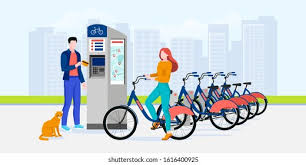

Bike-Sharing-Demand-Prediction Project2

 
  
<h1 align="center">  Bike-Sharing-Demand-Prediction  </h1> 
<h3 align="center"> AlmaBetter Verfied Project - <a href="https://www.almabetter.com/"> AlmaBetter </a> </h5>

     

 

<h2> :book:Introduction</h2>
Currently Rental bikes are introduced in many urban cities for the enhancement of mobility comfort. 
 <h2> :book:Problem Statements</h2>
It is important to make the rental bike available and accessible to the public at the right time as it lessens the waiting time. Eventually, providing the city with a stable supply of rental bikes becomes a major concern. The crucial part is the prediction of bike count required at each hour for the stable supply of rental bikes.

<h2> :book:Data Description</h2>
The dataset contains weather information (Temperature, Humidity, Windspeed, Visibility, Dewpoint, Solar radiation, Snowfall, Rainfall), the number of bikes rented per hour and date informatio
Attribute Information:
### Date : year-month-day

### Rented Bike count - Count of bikes rented at each hour

### Hour - Hour of he day

### Temperature-Temperature in Celsius

### Humidity - %

### Windspeed - m/s

### Visibility - 10m

### Dew point temperature - Celsius

### Solar radiation - MJ/m2

### Rainfall - mm

### Snowfall - cm

### Seasons - Winter, Spring, Summer, Autumn

### Holiday - Holiday/No holiday

### Functional Day - NoFunc(Non Functional Hours), Fun(Functional hours

<h2> :book: Depoyment on Heroku</h2>

[.png)]((https://bike-sharing-demand-predictio.herokuapp.com/)
)

for localhost :- http://127.0.0.1:8000/docs#

"Seasons"='Spring':1,'Summer':2,'Autumn':3,'Winter':4

"Holiday" = 'No Holiday':0,'Holiday':1

Functioning_Day" = 'No':0,'Yes':1

 <h2> :book:Conclusion</h2>
● From the above point plot and bar plot we can say that in the weekdays which represent in blue colour show that the demand of the bike higher because of the office. 

● Peak Time are 7 am to 9 am and 5 pm to 7 pm 

● The orange color represent the weekend days, and it show that the demand of rented bikes are very low especially in the morning hour but when the evening start from 
4 pm to 8 pm the demand slightly increases. 

● from the month 5 to 10 the demand of the rented bike is high as compare to other months. these months are comes inside the summer season. 

●the most positively correlated variables to the rent are : the temperature Humidity the dew point temperature Rainfall the solar radiation 

●most negatively correlated variables are: Humidity Rainfall

